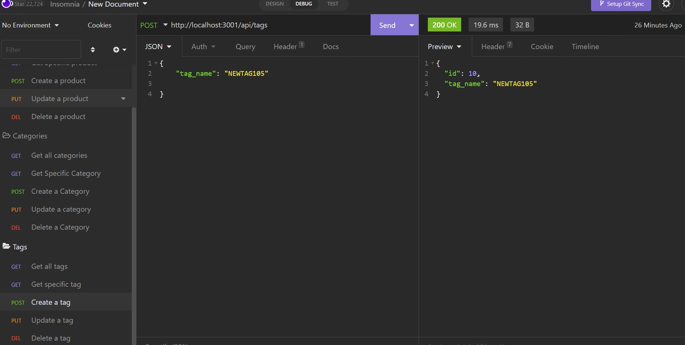

# E-commerce Back End

## Description

Back end of an e-commerce application which has Express.js API ans Sequelize to interact with MYSQL database.

## Table of contents

-[Installation](#Installation) -[Usage](#Usage) -[Contribution](#Contribution) -[Questions](#Questions) -[Screenshots](#Screenshots) -[Walkthrough](#Walkthrough)

## Installation

- npm init -y
- npm install express sequelize mysql2
- npm install dotenv

## Usage

- npm start

## Contribution

Sumit Ojha

## Questions

- sumit.ojha.dev@gmail.com
- https://github.com/sumitsann

## Screenshots

## Walkthrough

https://youtu.be/wPcNfWGE1g4
